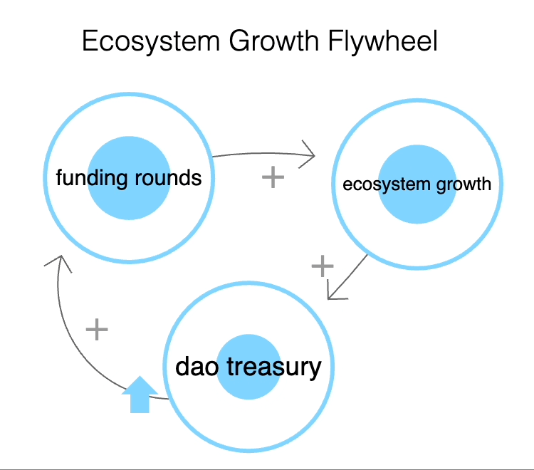
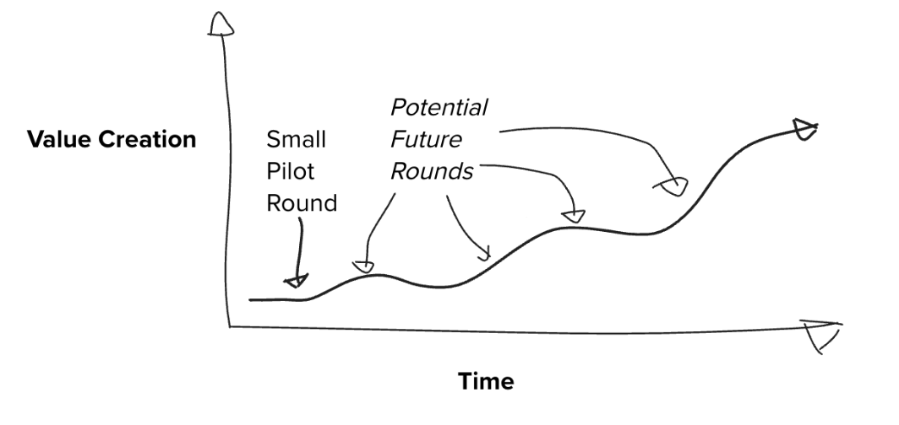

import { Callout } from "nextra/components";

<Callout type="warning">
  Warning: This resource describes planned functionality and processes that has
  not been implemented and is not part of any official roadmap. Be aware that parts may be inaccurate or out of
  date.  This document should not be relied on for financial, tax, business, or any other type of advice.  This document is not legal advice, please consult your own lawyer .
</Callout>

# Product Adoption

Gitcoin is several seed stage products:
    1. Passport
    2. Grants Stack 
    3. Allo 
    4. PGN

## How do these products win?

### Vertical integration

Each of the products are players in their niches, but they are not the biggest player in their niches.  
    - Passport is smaller than Worldcoin
    - Grants Program is smaller than OPtimism RPGF.
    - PGN is smaller than other L2s.
    - Allo is inchoate.

The vertically integrated stack of these products can win via
    - leveraging **vertical integration** to provide a seamless experience between the products.
    - leveraging **network effects** to bootstrap each product individually.
    - Leveraging Gitcoin's **strong brand** to move outside of web3 (UNICEF, American Cancer Society)

That said, the vertically integrated product suite provides its own challenges too.  Each product could be it's own startup.  Focus will be key to making sure each team can focus on their own outcomes.

### Waterfall marketing.

Each of the produts are should first focus on a small customer segment that is 
1. ready to love the product today.
2. able to influence others.

From there it can waterfall into greater adoption from there.

### Grants Stack

Grants Stack is the top of the funnel for the rest of the products.

The target customer set for Grants Stack EVM based communities that allocate over $10k/year in grants to their communities.   The adoption campaign should start with those who are able to influence others.

This is a crowded space, with Hedgey, ClrFund, Giveth, Sablier, all offering solutions here.  Many providers use notion, airtable, or charmverse to run their grants program, forgoing a grants-centric tool alltogether.

From our interviews with customers they demand:
1. something that is stable, effective, gets money going to ecosystem
2. to formalize how grants at their org flow, so that multiple operators can use the same flow.
3. to create community involvement in how the funds are distributed

Gitcoin offers a product suite that offers
1. credible neutrality
2. a swiss army knife of allocation methods (QF, QV, direct grants)
3. that can build an ecosystem funding flywheel

Q3 2023 will be about getting adoption into these communities + building momentum from there.

Grants Stack will be a tool that grows with you.

Right now Grants Stack is in pipeline with
1. Metamask
2. Linea (talking to)
2. Zksync Era
3. Polygon (Evaluation)
4. Arbitrum
5. BanklessDAO
6. Coinbase Advocacy
7. FWB,

Top Tier Customer Wish list:
1. Top L2s => DEFI => NFT => Any EVM based community
2. DEFI => SNX, AAVE, Maker, Chainlink, Uniswap

Open Questions:
1. how do we make the impact of QF rounds more mreasurable for communities.
2. Which capital allocation tools are the best?
3. Do [Gateway drug rounds](https://docs.google.com/document/d/1J3lKbG31_IyqdF-vYc3iRGq0tfR-PLz9EEDIMS1Rw0w/edit#heading=h.m4ucg5jddfxj) convert?

See [Grants Stack S19 Strategy](https://docs.google.com/document/d/1quyqzSr7jlkgglUlTp2mTydXeubi_rLZwA64GOVA19E/edit#heading=h.nkkmq9fvb2pj).

### Allo Protocol

Allo Protocol’s vision is ambitious: be the foundational resource allocation infrastructure for digitally local communities. Modern resource allocation is a large, nascent category that we’re in a unique position to define. Given how broad and undefined this space is, we’re using a vertical go-to-market (GTM) strategy. We want to identify verticals with specific resource allocation needs and systematically bring targeted use cases to those user bases.

Our initial focus is the web3 ecosystem growth vertical, as we are closer to the problem space from our history with Gitcoin Grants and have a healthy pipeline of interested web3 ecosystems. We have signal that web3 organizations tend to have ecosystem growth funds, which can be deployed through a variety of channels, including:
- grants programs
- improvement proposals
- hackathons
- bounties
- rfps
- investments

We want Allo to be the backbone for all of these channels, with an ecosystem of products serving these use cases. You can learn more about our GTM plan for this vertical here. Other potential verticals that we plan to explore include:
- Web3 governance
- Foundation grants (i.e. web2) funding
- Ephemeral fund allocation

[Per Allo Vision/Strategy](https://docs.google.com/document/d/18wwdBJhC6Ukgp-lZ_ecmL7_cim0YhdO6a6brylYlHhQ/edit)

Current Integration List
- EnDAOment
- Sablier
- Impact Stream
- Hats protocol
- Privy/Celo

### Passport

Passport is a flexible, easy-to-use API for protecting projects against bots and bad actors.

Target Audiences
- Integrators – community leaders wanting to protect their community activations from Sybil attacks (i.e., airdrops, governance votes, discord participation).
- Platform integrators – ecosystem leaders looking to protect their community activations from Sybil attacks and/or wanting to provide Sybil protection options for their users. Would act similarly to a traditional channel partner.
- Stamp providers – apps looking to integrate a proprietary stamp to ensure usage of their product can be reflected in a Passport-holder’s Unique Humanity Score. These apps also benefit from new exposure to Passport’s holder-base
- Passport holders – community members wanting to gain access to community activations and other projects protected by Passport

Our integrators need an effective & easy platform to prevent Sybils and bots from draining their communities resources. They also need a platform that helps with identifying real humans that want to actively participate in their community – to increase authenticity and trust between participants. 

[More about the passport GTM strategy here](https://docs.google.com/document/d/1_nxRjowoyeKV4AMusCDc35xbGeMOu3x1sy40P3pNQZc/edit)

### PGN

Provide as much funding to regen projects as possible.
Provide cheap block space to users.

TODO Kyle - write more about the strategy here.

