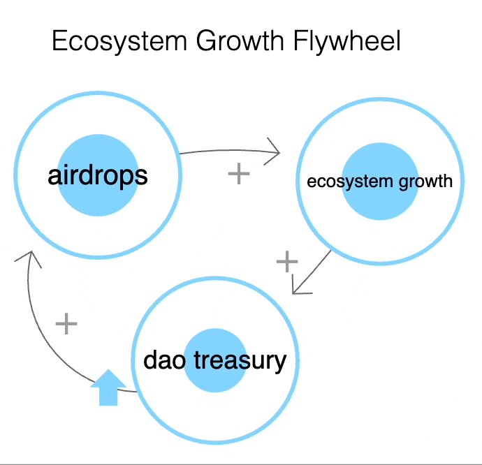

import { Callout } from "nextra/components";

<Callout type="info">
+This document is version 0.1.0 + should be considered a "rough draft".  The version numbers will increment to v0.2.*, v0.3.*, and so on... until an endgame plan is accepted by DAO governance (version 1.0).
</Callout>

<Callout type="warning">
  Warning: This resource describes planned functionality and processes that has
  not been implemented and is not part of any official roadmap. Be aware that parts may be inaccurate or out of
  date.  This document should not be relied on for financial, tax, business, or any other type of advice.  This document is not legal advice, please consult your own lawyer .
</Callout>
# More Airdrops

The original quadraticlands.com airdrop was massively successful in articulating a vision for Gitcoins future & stimulating ecosystem growth by allowing contributors to feel a sense of responsibility for the Gitcoin ecosystem.

Other ecosystems (notably optimism) have evolved doing multiple airdrops as a means of rewarding users for the value they have provided the network.  These airdrops reward ecosystem value over time.

We propose that Gitcoin do future airdrops of GTC.  Such airdrops could be focused on anyone who is providing value to the ecosystem to the ecosystem, especially:

1. Contributors, to give them stake in the game + reward them for building Gitcoin.
2. Protocol users, to give them stake in the game + reward them for using the protocols.
3. Partners, *
4. and so on.

In order to minimize airdrop farming, the reward function of each airdrop should evolve each time an airdrop is performed in order to weed out farmers and focus on actually engaged users.

It is also suggested to use Gitcoins products (especially Grants Stack and [Passport Faucet](https://twitter.com/owocki/status/1671581682925965312)) to distribute airdrops.

