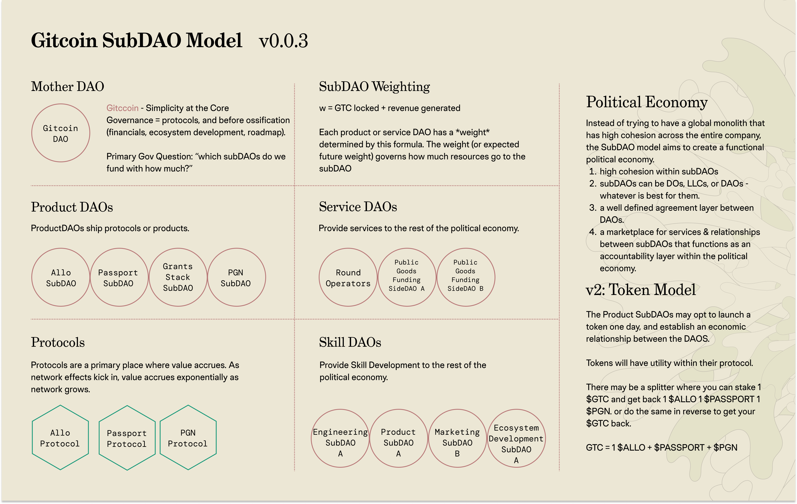
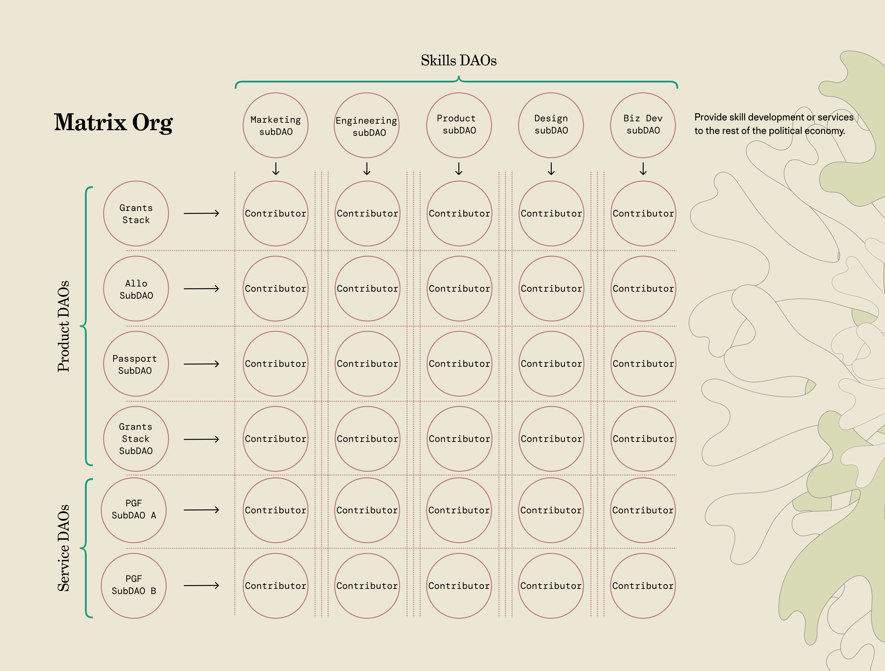
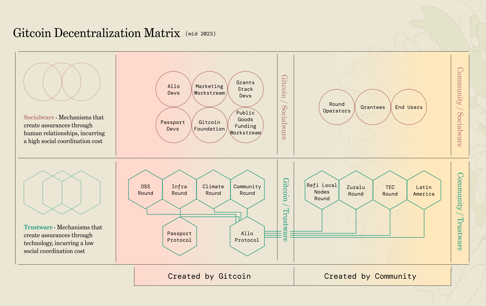
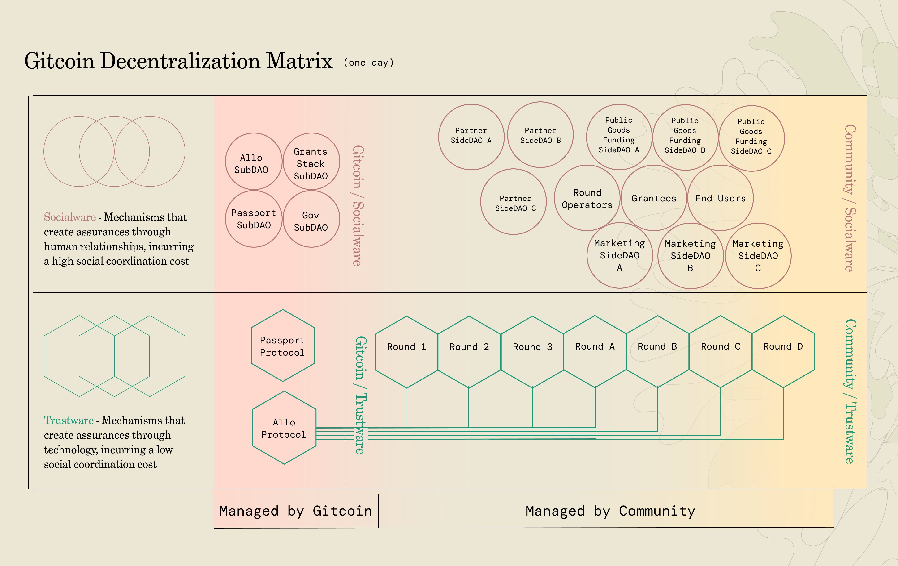
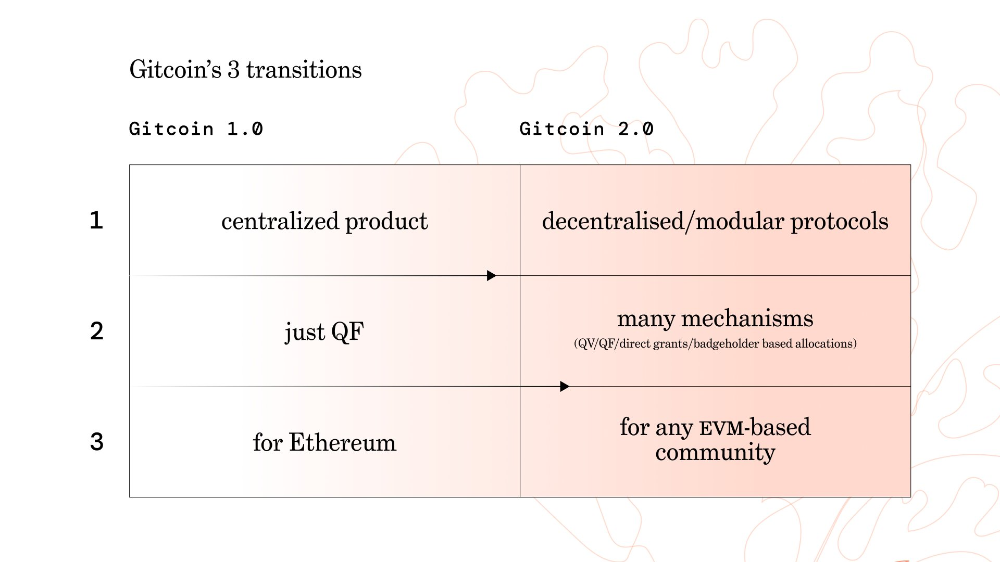

import { Callout } from "nextra/components";

<Callout type="warning">
  Warning: This resource describes planned functionality and processes that has
  not been implemented and is not part of any official roadmap. Be aware that parts may be inaccurate or out of
  date.  This document should not be relied on for financial, tax, business, or any other type of advice.  This document is not legal advice, please consult your own lawyer .
</Callout>

# Sub-DAOs

## Problem Statement

As Gitcoin has evolved towards more decentralization, there has been more pressure put on GTC governance.  

From 2021 - 2023, as Gitcoin Grants was broken into 4 different protocols/products, this created a lot of complexity and need for context in order to govern Gitcoin.

As a result, https://gov.gitcoin.co became a place where there was a clear division between stewards that were core contributors to Gitcoin, and stewards who were outside community contributors.  Over time, the latter contributors were not able to contribute.

After Gitcoin has gotten it's product market fit, it may be wise to reform governance in order to push the complexity and context further to the edges.

This SubDAO proposal is a solution to these problems.  

## Proposed Solution

The SubDAO proposal is meant to solve the following problems:

1. Push complexity away from Gitcoin Core
2. Give each subDAO a singular focus.
3. Still benefit from the network effects of being in the same economic bloc.

The subdao economy represents that Gitcoin is a political economy, not a company.  By formalizing the political economy into a marketplace, checks and balances are provided by the economic relationships between the subDAOs.

Instead of trying to have a global monolith that has high cohesion across the entire company, the SubDAO model aims to create a functional political economy. 
1. high cohesion within subDAOs
2. subDAOs can be DOs, LLCs, or DAOs - whatever is best for them.
3. a well defined agreement layer between DAOs.
4. a marketplace for services & relationships between subDAOs that functions as an accountability layer within the political economy.

The subDAO model has the following types of subDAOs.  Each of the subDAOs will follow the same budgeting process that workstreams use today.:

## Types of SubDAOs

### Mother DAO

Gitcoin is the Mother DAO.  Governance of Gitcoin = governance of it's protocols, and before ossification (financials, ecosystem development, roadmap).

### Primary Gov Questions

#### Which subDAOs do we fund & with how much?

A proposed anchor point for this question would be: 

> w₁ = GTC_locked + revenue_generated_in_usd

In the event that a product is pre-revenue their weight can be determined by 

> w₂ = size_of_subDAO_economy_in_usd

w₁ can we be thought of kinetic energy, w₂ can be thought of as potential energy.  They can be combined as follows

> w₃ = w₂ + w₁

Each product or service DAO has a *weight* determined by this formula. The weight (or expected future weight) governs how much resources can legitimately go to the subDAO.

Weights can also have subweights which can be applied to weighting formulas to change their relative importance of those metrics relative to other metrics.:

> weight_of_gtc_locked = 1 # weight of gtc lock relative to other metrics
>
> weight_of_usd_revenue_in = 1 # weight of usd revenue in relative to other metrics
>
> weight_of_economy_size = 1 # weight of pre-revenue economies relative to other metrics
>
> weight_of_bull_bear = 1 # set higher in a bull market, lower in a bear

Applied to the formulas as follows:

> w₁ = ( GTC_locked * weight_of_gtc_locked ) + ( revenue_generated_in_usd * weight_of_usd_revenue_in )
>
> w₂ = ( size_of_subDAO_economy * size_of_subDAO_economy_in_usd )
>
> w₃ = w₂ + w₁

In practice, this is used to weigh resources going to different subDAOs.  For example, if there are 3 subDAOs who have 

- w₃(SubDAO A) = 15
- w₃(SubDAO B) = 80
- w₃(SubDAO C) = 5
- w₃(All SubDAOs) = 100

Then SubDAO A would get 15% of funding for that quareter, SubDAO B would get 80%, and so on..

#### Tuning parameters on the protocols

As more GTC Utility is built in, the DAO would be in charge of managing parameters on the protocols.

### Product DAOs

ProductDAOs ship protocols or products.

The Product SubDAOs may opt to launch a token one day, and establish an economic relationship between the DAOS.

Tokens will have utility within their protocol.

There may be a splitter where you can stake 1 $GTC and get back 1 $ALLO 1 $PASSPORT 1 $PGN. or do the same in reverse to get your $GTC back.  This relationship forms the governance bond between Gitcoin and the product subDAO.

These tokens provide governance rights within the protocols they represent:
1. $ALLO and $GTC may be used to create utility or governance rights in Allo Protocol.
1. $PASSPORT and $GTC may be used to create utility or governance rights in Passport Protocol.
1. $PGN and $GTC may be used to create utility or governance rights in Allo Protocol.

GTC = 1 $ALLO + $PASSPORT + $PGN

### Service DAOs

Provide services to the rest of the political economy.

### Skill DAOs

Provide skill development or services to the rest of the political economy.

## Visual Overview

## Matrix Organization

One contributor can be a member of multiple subDAOs.

The subDAOs can be thought of as a matrix organization, insofar as a contributor may be a part of a multiple subDAOs at once, and have different expectations for each subDAO.  A contributor who does marketing for Passport, for example, may be responsible to the Passport subDAO's governance structure to deliver products, and be responsible to the marketing subDAO to provide marketing alignment, skill development, or other marketing-centric services to the marketing subDAO.

## Interfaces between subDAOs

The subDAO model is designed to give each subDAO control of its own scope & autonomy to pursue its own vision, but to be able to interface with other subDAOs.

Each subDAO has the authority to
1. define their own scope.
2. define their own governance structure.
3. bid on work from the motherDAO or other subDAOs.

The interface between subDAOs can be on three layers 
1. Social - friendships + social aligment.
2. Techological - protocols or products talking to each other.
3. Economic - token swaps or tokens/revenue flowing between subdaos.

## Decentralization

### SubDAOs at the start

### SubDAOs a few years in

### Permissioning subDAOs

As the different subDAOs will live in an increasingly protocolized world and also an increasingly modular world, it will be important to give each module permissions to manage their portion of this ecosystem trustlessly & with autonomy.  A protocol like https://www.hatsprotocol.xyz/ could be used to give subDAOs access to native parts of the protocol

For example, hats (a primitive in https://www.hatsprotocol.xyz/) could

1. be given to a PGF subDAO to manage a round
2. be given to the finance subDAO to rebalance the treasury
3. be given to allo dev subdao to perform upgrades
4. and so on..

By formalizing and modularizing permissions to subdaos, we can solve for 

1. organizational bloat
2. too many cooks in the kitchen
3. creating autonomy around different subject matteres
4. and so on..

[This thread](https://twitter.com/KyleSt4rgarden/status/1697392266422472934) goes into more details.

### SubDAO Alignment

One basic rule of thumb for the subDAO model is that we should not externalize harms from one workstream/subdao to another.

Another way of saying this is dont allow behavoiur that depletes common pool resources upon which we all depend (brand, network effects).

For example, closing a deal with shell/similar without a plan to mitigate the blast radius is externalizing harm.  Youre effectively borrowing against the brand to make your own revenue goals.  and youre consuming the substrate upon which we all depend (the brand)

What we want is to reverse this "externalize harm" trend and instead create an "externalize goods".  so passport externalizes sybil resistence.  grants stack exports network effects, and so on. 

The way to enforce this is for governance to actively track what the economy of harms/goods being externalized looks like, and work to resolve them.

### Progressive Decentralization

The subDAO model provides a framework for socialware work to be moved from Gitcoin-centric to a more community centeric world.

In the future, there may be multiple subDAOs that serve similar purposes.  

For example, 
1. a eth oss PGF dao might organizae eth oss QF rounds + will own the decision of who is accepted into that round 
1. a climate PGF dao might organizae climate QF rounds + will own the decision of who is accepted into that round (shell or not)
1. a DEI PGF dao might organizae DEI QF rounds + will own the decision of who is accepted into that round (shell or not)
1. and so on..

It is possible that subDAOs will be more like "side DAOs" in so far as they are welcome to do work for other organizations in the web3 ecosystem.

It is possible that subDAOs will compete for work with each other.  eg 
1. UI/UX SubDAO A that bids for work against other dev SubDAOs.
1. Marketing SubDAO A that bids for work against other marketing SubDAOs.
1. and so on..

## Final Destination: Ossification

With Ossification, we can create very hard guarantees about the supply of a digital asset or an economic contract.  Eventually the governance of Gitcoin could Ossify into only its primary governance functions.  More socialware or mutable structures would be housed in subDAOs, in order to provide for future innovation or protocol upgrades.

## Final Destination: Modular Ecosystem

Gitcoin 2.0 is available:
0. as decentralized/modular protocols
1. with many mechanisms
2. for any EVM based community

