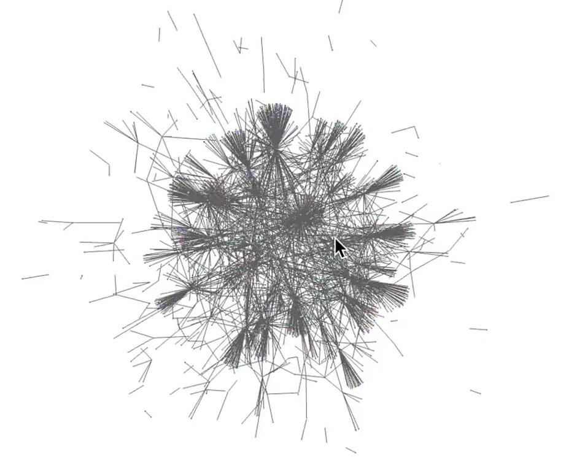

import { Callout } from "nextra/components";

<Callout type="info">
This document is version 0.1.0 + should be considered a "rough draft".  The version numbers will increment to v0.2._, v0.3._, and so on... until an endgame plan is accepted by DAO governance (version 1.0).
</Callout>

<Callout type="warning">
  Warning: This resource describes planned functionality and processes that has
  not been implemented and is not part of any official roadmap. Be aware that parts may be inaccurate or out of
  date.  This document should not be relied on for financial, tax, business, or any other type of advice.  This document is not legal advice, please consult your own lawyer .
</Callout>
# gitcoin.vc

Quadratic Funding (QF) Tools like Gitcion Grants are a way to **Fund What Matters** in your ecosystem.  

Invented in 2018 by Vitalik Buterin, Glen Weyl, and Zoe Hitzeg, QF is a mechanism for democratically distributing capital. 

How the mechanism works:

1. Large donors raise a matching pool.
2. A crowdfund campaign is started where ecosystem projects can receive funding from small donors.
3. During the crowdfund campaign, contributions from small donors are matched by the matching pool according to which projects are the most popular (not those which raise the most money).
4. For example, is project A gets $100 from 100 contributors, and project B gets $100 from 1 contributor, project A will get 99% of the matching pool.
5. Whats really beautiful about this is that even giving a dollar can create $10s or $100s in funding.  It creates a real incentive to give.  This means QF rounds create a very rich dataset.

On Gitcoin, this mechanism has been used to fund $50m through 3.8m unique donations.

From a strategic perspective, QF is a great way to:

1. Fund What Matters democratically.
2. Support democratic institutional decision making & give more community agency in funding decisions.
3. Push power to the edges, away from whales & other centralized points of power.
4. Double your money!  Your community co-funds your ecosystem with you.

I want to highlight something  that idk if other people see: 

> QF generates a signal of what your community cares about.

*Economic Social Graph of GG14: Each node is a user/grant, each edge is a transaction*

This signal is immensely valuable.  Much more valuable than most people realize.  Let me explain.

Early in Gitcoin rounds 1-5, we saw that projects like Uniswap, Yearn, 1inch were among the top funded projects in the QF rounds.  A market cycle later, these projects are now unicorns.

It's no mistake that these projects were among the most popular in the QF rounds.  QF systematically up-regulates the projects that have the respect of their peers. The fact that so many ecosystem participants supported them was a leading indicator that they were doing something that was important/legit.

Having access to this data *early* is  what I call QFEV - Quadratic Funding Extractable Value.  

I think there is something very valuable here.

What if we could find the next Uniswap before anyone else?

What if projects that raised QF were able to opt-in to receive partnership, sponsorship, or investment offers after the round?   What would have to be true to bottle up this QFEV?

There is alpha in having access to this data before a project gets hot.

Of course this data is available on chain + anyone can access it.  But no one has yet built a tool to do so.  

Gitcoin has immaculate dealflow.  Uniswap, yearn, etc...  What if we were to monetize this QFEV?

We could either
1. sell access to the dealflow to VCs
2. sell access to the dealflow to partner ecosystems
3. start a VC fund Gitcoin.VC that invests in these projects. 

