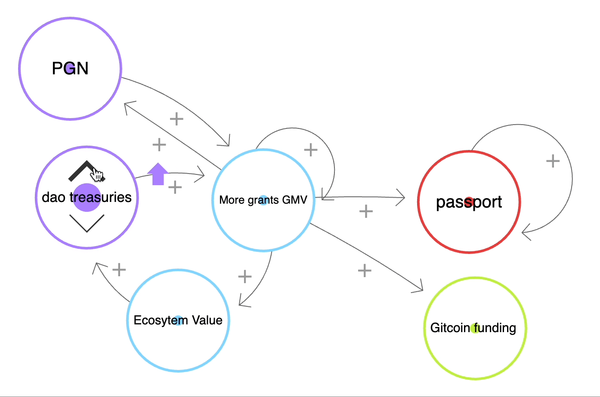

import { Callout } from "nextra/components";

<Callout type="warning">
  Warning: This resource describes planned functionality and processes that has
  not been implemented and is not part of any official roadmap. Be aware that parts may be inaccurate or out of
  date.  This document should not be relied on for financial, tax, business, or any other type of advice.
</Callout>

# We are here.

## Gitcoin offers the following products:

1. Grants Stack - An end-to-end grants solution customized to your needs.
2. Allo Protocol -  An open-source protocol that enables groups to efficiently and transparently allocate pooled capital.
3. Passport - A privacy perserving sybil resistence aggregator.
4. PGN - An L2 for public goods projects to earn funding.
5. GTC - The governance token for Gitcoin.

## What problem does each of these products solve, and for whom?

### Grants Stack

1. Any EVM-based ecosystem that wants to build ecosystem value by funding what matters in their ecosystem, can use Grants Stack to do it.
2. Any project within that EVM-based ecosystem that wants to get funding for their dApp, can use Grants Stack to do it.
3. Any consumer within that ecosystem that wants to discover and/or fund new dApps, initiatives, or projects, can use Grants Stack to do it.

### Allo Protocol

1. Developers who want to integrate Quadratic Funding, Quadratic Voting, retroactive public goods funding, or any other capital allocation mechanism into their app, can use Allo Protocol to do it.
2. Developers who want to create an alternative to Grants Stack, can use Allo Protocol to do it.

### Passport

1. Ecosystems that easy sybil resistence for their ecosystem, can use Passport to do it.
2. Users who want to earn rewards within those ecosystems, can use Passport to do it.

### PGN

Developers who want to earn revenue for their dApps, can deploy their apps to PGN.

### GTC

1. People who want to govern Gitcoin can use GTC to do it.
1. People who want superpowers (advanced features) on Gitcoin can use GTC to do it. (🔜™️)

## How do all of these things fit together?  

1. They were built to service each other, but opened up new business lines for Gitcoin.
    - Passport was built to service Gitcoin Grants and solve our Sybil problem. It now is the largest aggregator of identities and sybil protection.
    - GTC was launched to solve governance of Gitcoin Grants’ key decisions and is now being used as a means to earn identity legitimacy, and soon will govern the Allo protocol in addition to being used for key grants program decisions.
    - PGN was launched to fund public goods, where Gitcoin is one key stakeholder.
    - Grants Stack / Allo Protocol are the new decentralized/modular versions of Gitcoin Grants
        - Grants Stack was launched to enable efficient capital allocation with transparency and accountability to the outcomes pledged (by both the orgs funding, and the grantees receiving money)
        - Allo protocol was launched to continue experimentation with novel funding mechanisms, and to ensure permissionless, modular funding was possible for all.
            - Why does Allo need to be modular? Because Quadratic Funding is not the only capital allocation method out there.  We envision a handful of capital allocation mechanisms, each solving one thing and doing it well (unix phillosophy style).  Original Gitcoin grants was a pocketknife, Allo protocol is a swiss army knife with many complementary tools on it.
            - Why does Allo need to be permissionless (aka decentralized)? Decentralization provides censorship resistence, democratic decision making, and easy forkability.
2. These solutions build network effects and grow the legitimacy and positive sum outcomes for one another as they scale. (See below)

