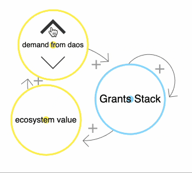
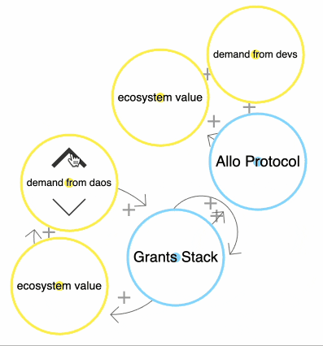
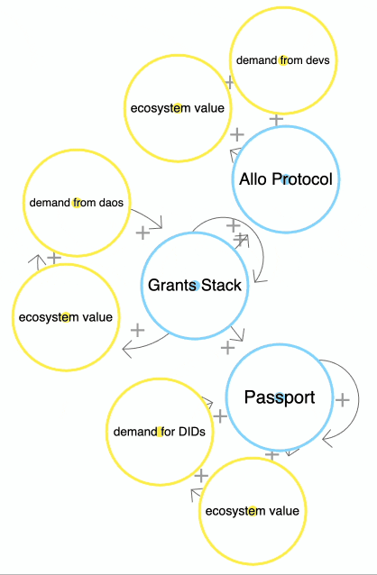
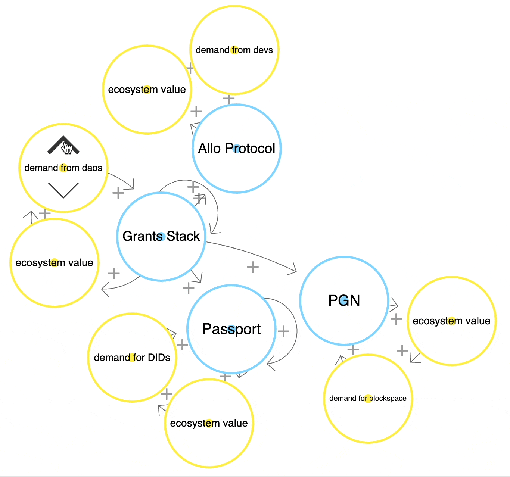
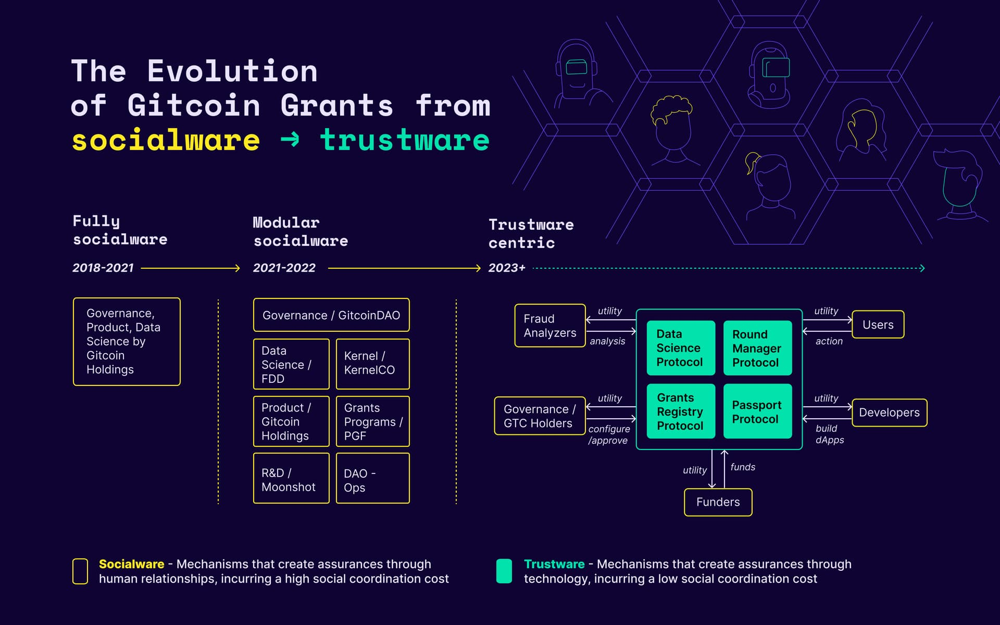

import { Callout } from "nextra/components";

<Callout type="info">
+This document is version 0.1.0 + should be considered a "rough draft".  The version numbers will increment to v0.2.*, v0.3.*, and so on... until an endgame plan is accepted by DAO governance (version 1.0).
</Callout>

<Callout type="warning">
  Warning: This resource describes planned functionality and processes that has
  not been implemented and is not part of any official roadmap. Be aware that parts may be inaccurate or out of
  date.  This document should not be relied on for financial, tax, business, or any other type of advice.  This document is not legal advice, please consult your own lawyer .
</Callout>
# We are here.

## TLDR

Gitcoin offers a suite of products. 

Each product solves a problem for end users and also for other products in the network.  

The core of each product is trustware (mechanisms that create assurances through technology, as opposed to through social coordination).

These produces are:
1. **Grants Stack** - An end-to-end grants solution customized to your needs.
2. **Allo Protocol** -  An open-source protocol that enables groups to efficiently and transparently allocate pooled capital.
3. **Passport** - A privacy perserving sybil resistence aggregator.
4. **PublicGoods.Network** - An L2 for public goods projects to earn funding.
5. **GTC** - The governance token for Gitcoin.

## What problem does each of these products solve, and for whom?

### Grants Stack

https://www.gitcoin.co/grants-stack

Grants Stack is a complete solution for grants program amangement.  Grants Stack contains 
- Manager - a tool for creating a Grants campaign
- Builder - a tool for building Grants
- Explorer - a tool for exploring & funding grants

It serves:
1. Any EVM-based ecosystem that wants to build value for their community by funding what matters.
2. Any project within that EVM-based ecosystem that wants to get funding for their dApp.
3. Any consumer within that ecosystem that wants to discover and/or fund new dApps, initiatives, or projects.

#### Grants Stack TAM

The TAM (total addressable market) for Grants stack is somewhere around $35million right now, but will grow as the ecosystem grows.  [[reference document]](https://docs.google.com/spreadsheets/d/17HiET73WqE2OlzIsCh88vcQcGCRjng14NIuA82PiH_M/edit#gid=0)

#### Grants Stack Network Effects

### Allo Protocol

https://allo.gitcoin.co/

Allo (short for Allocation) Protocol is a community resource allocation protocol.

It serves:
1. Developers who want to integrate Quadratic Funding, Quadratic Voting, retroactive public goods funding, or any other capital allocation mechanism into their app.
2. Developers who want to create an alternative to Grants Stack.

#### Allo Protocol TAM

The TAM for Grants stack is somewhere around $35million right now (similar market to Grants Stack), but will grow as the ecosystem grows.  [[reference document]](https://docs.google.com/spreadsheets/d/17HiET73WqE2OlzIsCh88vcQcGCRjng14NIuA82PiH_M/edit#gid=0)

#### Allo Protocol Network Effects

Allo protocol receives usage from Gitcoin Grants Stack and provides a credibly neutral, decentralized, funding allocatoin layer in return.

### Passport

https://passport.gitcoin.co/

Passport is a privacy-preserving identity protocol.

It serves:
1. Ecosystems that need easy sybil resistence or collusion resistence for their ecosystem.
2. Users who want to earn rewards within those ecosystems.
3. Data scientists who want to earn rewards for finding sybil attackers.

#### Passport TAM

The TAM for Passport right now is every web3 user ([estimated](https://zipdo.co/statistics/web3/) to be about 1.5m users right now), but could grow to anyone on earth one day. 

#### Passport Network Effects

Passport receives usage from Gitcoin Grants Stack and solves a problem for them (sybil resistence)

[](https://ncase.me/loopy/v1.1/?data=[[[12,561,342,0,%22demand%2520from%2520daos%22,2],[20,786,558,0,%22Passport%22,4],[21,692,434,0,%22Grants%2520Stack%22,4],[22,549,469,0,%22ecosystem%2520value%22,2],[25,756,684,0,%22ecosystem%2520value%22,2],[26,653,596,0,%22demand%2520for%2520DIDs%22,2],[32,793,316,0,%22Allo%2520Protocol%22,4],[33,790,184,0,%22demand%2520from%2520devs%22,2],[34,673,237,0,%22ecosystem%2520value%22,2]],[[12,21,32,1,0],[21,22,52,1,0],[22,12,37,1,0],[21,20,5,1,0],[20,20,88,1,93],[21,21,89,1,45],[20,25,25,1,0],[25,26,26,1,0],[26,20,15,1,0],[21,32,-8,1,0],[32,34,7,1,0],[34,33,-17,1,0],[33,32,9,1,0]],[],34%5D)

### PublicGoods.Network

https://publicgoods.network/

PublicGoods.Network (PGN) is an OP Stack L2 that funds public goods through sequencer fees.

It serves:
1. Developers who want to earn revenue for their dApps.
2. Users who want to use the latest regen apps.

#### PGN TAM

A market sizing exercise for PGN is TBD.

#### PGN Network Effects

PGN receives usage from Grants Stack/Allo Protocol, and provides cheap blockspace back to them.

[](https://ncase.me/loopy/v1.1/?data=[[[12,561,342,0,%22demand%2520from%2520daos%22,2],[20,786,558,0,%22Passport%22,4],[21,692,434,0,%22Grants%2520Stack%22,4],[22,549,469,0,%22ecosystem%2520value%22,2],[24,937,520,0,%22PGN%22,4],[25,756,684,0,%22ecosystem%2520value%22,2],[26,653,596,0,%22demand%2520for%2520DIDs%22,2],[27,1081,547,0,%22ecosystem%2520value%22,2],[28,969,651,0,%22demand%2520for%2520blockspace%22,2],[32,793,316,0,%22Allo%2520Protocol%22,4],[33,790,184,0,%22demand%2520from%2520devs%22,2],[34,673,237,0,%22ecosystem%2520value%22,2]],[[12,21,32,1,0],[21,22,52,1,0],[22,12,37,1,0],[21,20,5,1,0],[20,20,88,1,93],[21,21,89,1,45],[20,25,25,1,0],[25,26,26,1,0],[26,20,15,1,0],[24,27,6,1,0],[27,28,3,1,0],[28,24,22,1,0],[21,32,-8,1,0],[32,34,7,1,0],[34,33,-17,1,0],[33,32,9,1,0],[21,24,19,1,0]],[],34%5D)

### GTC

https://www.gitcoin.co/gtc

GTC is the governance token of the Gitcoin network

It serves:
1. People who want to govern Gitcoin.
1. People who want superpowers (advanced features) on Gitcoin's suite of products (🔜™️)

#### GTC TAM

A market sizing for GTC is TBD.

#### GTC Network Effects

GTC provides a credibly neutral, decentralized, community-governed legitimacy layer for the rest of the portfolio.

## How do all of these things fit together?  

1. They were built to service each other, but opened up new business lines for Gitcoin.
    - **Passport** was built to service Gitcoin Grants and solve our Sybil problem. It now is the largest privacy-preserving aggregator of identities to provide sybil protection.
    - **GTC** was launched to solve governance of Gitcoin Grants’ key decisions and is now being used as a means to earn identity legitimacy, and soon will govern the Allo protocol in addition to being used for key grants program decisions.
    - **PGN** was launched to fund public goods, where Gitcoin is one key stakeholder.
    - **Grants Stack / Allo Protocol** are the new decentralized/modular versions of Gitcoin Grants
        - **Grants Stack** was launched to enable efficient capital allocation with transparency and accountability to the outcomes pledged (by both the orgs funding, and the grantees receiving money)
        - **Allo protocol** was launched to continue experimentation with novel funding mechanisms, and to ensure permissionless, modular funding was possible for all.
            - Why does Allo need to be modular? Because Quadratic Funding is not the only capital allocation method out there.  We envision a handful of capital allocation mechanisms, each solving one thing and doing it well (unix phillosophy style).  Original Gitcoin grants was a pocketknife, Allo protocol is a swiss army knife with many complementary tools on it.
            - Why does Allo need to be permissionless (aka decentralized)? Decentralization provides censorship resistence, democratic decision making, and easy forkability.
2. These solutions build network effects and grow the legitimacy and positive sum outcomes for one another as they scale. (See below)

### Network Effects

Gitcoin is shaped kind of like a starfish 𓇼, wherein each product is a "leg" of the starfish.

Each leg is complementary to the other legs.  Each product

0. has it's own target market and USP.
1. delivers utility to end users.
2. solves problems in the other products.
3. drives network effects to other products.

[](https://ncase.me/loopy/v1.1/?data=[[[12,341,226,0,%22demand%2520from%2520daos%22,2],[20,566,442,0,%22Passport%22,4],[21,472,318,0,%22Grants%2520Stack%22,4],[22,329,353,0,%22ecosystem%2520value%22,2],[23,709,270,0,%22Gitcoin%2520treasury%2520%22,4],[24,717,404,0,%22PGN%22,4],[25,536,568,0,%22ecosystem%2520value%22,2],[26,433,480,0,%22demand%2520for%2520DIDs%22,2],[27,861,431,0,%22ecosystem%2520value%22,2],[28,749,535,0,%22demand%2520for%2520blockspace%22,2],[29,819,159,0.5,%22stewards%22,1],[30,705,118,0.5,%22maintainers%22,1],[31,848,267,0.5,%22tokenholders%22,1],[32,573,200,0,%22Allo%2520Protocol%22,4],[33,570,68,0,%22demand%2520from%2520devs%22,2],[34,453,121,0,%22ecosystem%2520value%22,2]],[[12,21,32,1,0],[21,22,52,1,0],[22,12,37,1,0],[21,20,5,1,0],[20,20,88,1,93],[21,21,89,1,45],[20,25,25,1,0],[25,26,26,1,0],[26,20,15,1,0],[24,27,6,1,0],[27,28,3,1,0],[28,24,22,1,0],[21,32,-8,1,0],[32,23,-9,1,0],[24,23,21,1,0],[20,23,25,1,0],[23,20,-16,1,0],[32,34,7,1,0],[34,33,-17,1,0],[33,32,9,1,0],[21,24,19,1,0],[23,21,-15,1,0]],[[777,348,%22trustware%22],[904,363,%22socialware%22]],34%5D)

The core of Gitcoin's flywheel is made out of trustware.  Trustware are mechanisms that create assurances through technology, incurring a low social coordination cost.  As opposed to Socialware (mechanisms that create assurances through human relationships, incurring a high social coordination cost).

Gitcoin started as socialware (high social coordination cost) + more trustware (low social coordination cost) has evolved over time. Once Trustware runs all of the core operations of Gitcoin’s products, then Gitcoin is a hyperstructure (a crypto protocol that can run for free and forever, without maintenance, interruption or intermediaries).  You can read more on this evolution [here](https://gov.gitcoin.co/t/knowledge-transfer-the-gitcoin-hyperstructure/11335).

By pushing the complexity and trustfullness of social coordination to the edges (as opposed to the center) of the "organization", and making the core into smart contracts on uncensorable & transparent global blockchains, we can (in theory) ensure Gitcoin's anti-fragility and network effects driven growth for some time.

Over time, as Gitcoin evolves, we could see network utility grow linearly sometimes, and exponentially sometimes [due to Metcalfes law](https://en.wikipedia.org/wiki/Metcalfe%27s_law).  

At times, this growth will hit friction or growth ceilings.  It is the work of the maintainers, contributors, and tokenholders of Gitcoin to reduce this friction and work through growth ceilings.  
If they are successful, the friction of Gitcoin's network must be minimized and network efficacy must be maximized.