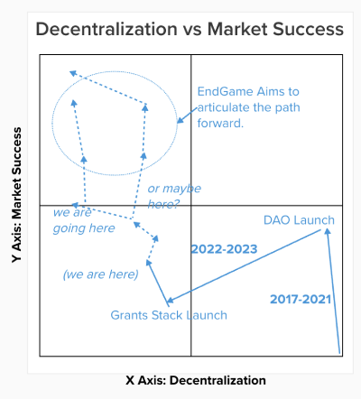

import { Callout } from "nextra/components";

<Callout type="warning">
  Warning: This resource describes planned functionality and processes that has
  not been implemented and is not part of any official roadmap. Be aware that parts may be inaccurate or out of
  date.  This document should not be relied on for financial, tax, business, or any other type of advice.
</Callout>

# Kyle version

These solutions build network effects and grow the legitimacy and positive outcomes for one another as they scale. (See below)
Goals…. 

Ensure Gitcoin is:
- Early game - **Stabilized** - Roadmaps aligned, teams are executing, and DAO burn is normalized to high measurable ROI investments
- Mid game - **Thriving** - financially, socially and technically. Gitcoin will continue to be a model for sustainability and DAO excellence
- End game - **Decentralized** across governance, protocol advancement, token holder representation, computation (where applicable).
- End game - **Lucrative** - for those participating, for those integrating, for those with ambition and those willing to invest. (Not just financially, but socially, emotionally  and technologically)

# Where are we going?

## Goals 

The Goals for the endgame are to ensure Gitcoin is:

1. (mid-game, 18 months) as **successful** as possible in achieving it's mission.
2. (mid-game, 18 months) **thriving** financially (not just *sustainable*).
3. (end-game, 4 years) **decentralized** at the layers of governance, product, tokenholder, and computation.
4. (end-game, 4 years) **reduce overhead** by cutting scope creep & relentlessly promoting focus.
5. (evergreen) **force trade-offs** in timing, resourcing, & other tradeoff spaces in order to chart a clear course to goals 1-5.

## Values

Other values to adhere to along the journey:
- Mission alignment
- Ethereum alignment
- Co-op values, mutualism, non plutocracy
- Simplicity at the center, Complexity to edges
- Outside Legitibility
- Incentive Alignment
- Momentum & Network Effects
- Pragmatism

### Tradeoff space

There are tradeoffs between these value & goals.  

One of the primary ones is market successs vs decentralization.  Here is a visual of Gitcoin's journey along these two axises:

Over the course of endgame, it will be necessary to weigh these tradeoffs and sequence work in a pragmatic way.  In  the endgame plan, we will call out these values & surface recommended paths through tradeoffs, but it'll be up to governance to decide the path through..

## Core Elements

This Endgame Plan consists of the following main components, in sequence:
1. Maximize Product market fit.
2. Financial sustainability.
3. Ossify core.

## Specific plans

### 1. Maximize product market fit

0. What has taken so long?
	1. Diagnosis of Gitcoins current malaise - despite high quality team members indinvidually, some products are failing in market. market has passed it by. no sense of urgency, stuck in meta trap.. despite high sepnding, we missed ETHDenver 13-5-5 goals.
	2. We spent 24 months rewriting the entire stack - legal, governance, people, product, tech
1. articulate vitalik style roadmaps on path forward/ the path to PMF for:
	1. Passport
	2. Grants Stack
	3. Allo 
	4. PGN
	5. GTC
1. How we win in market for each product, and for the products at large.
	- vertical integration
	- network effects
	- good brand
	- turn up the clock speed to explore the PMF design space faster
3. Compounding momentum
  0. all in on optimism.
  0. working in public is a superpower. 
	1. Shout it from the rooftops: we are so back 
	2. Another airdrop
	3. add performance bonuses to comp structure endgame
	4. stop falling into https://gov.gitcoin.co/t/the-meta-trap/10666
	5. Network effects.
  6. Copy Optimism mission and intents
  7. Stop flying blind, invest in analytics/data infrastructure.
  8. Establish more aggressive goals than 13-5-5 for next 6 months.
  9. Fix our devrel, blanked the market with “Gitcoin protocol(s) r here”.
  10. Establish Elder Steward Council with actual web3 founders/innovators.

### 2. Financial sustainability.

1. tokenomics
2. protocol governance
3. token utility

### 3. Ossify core & push complexity to other places.

0. Invest in AI to level the playing field of understanding.
1. Push complexity to other places / Break into sub-daos.
2. Embrace network effects.
3. Ossify core into final form
4. going mainstream

