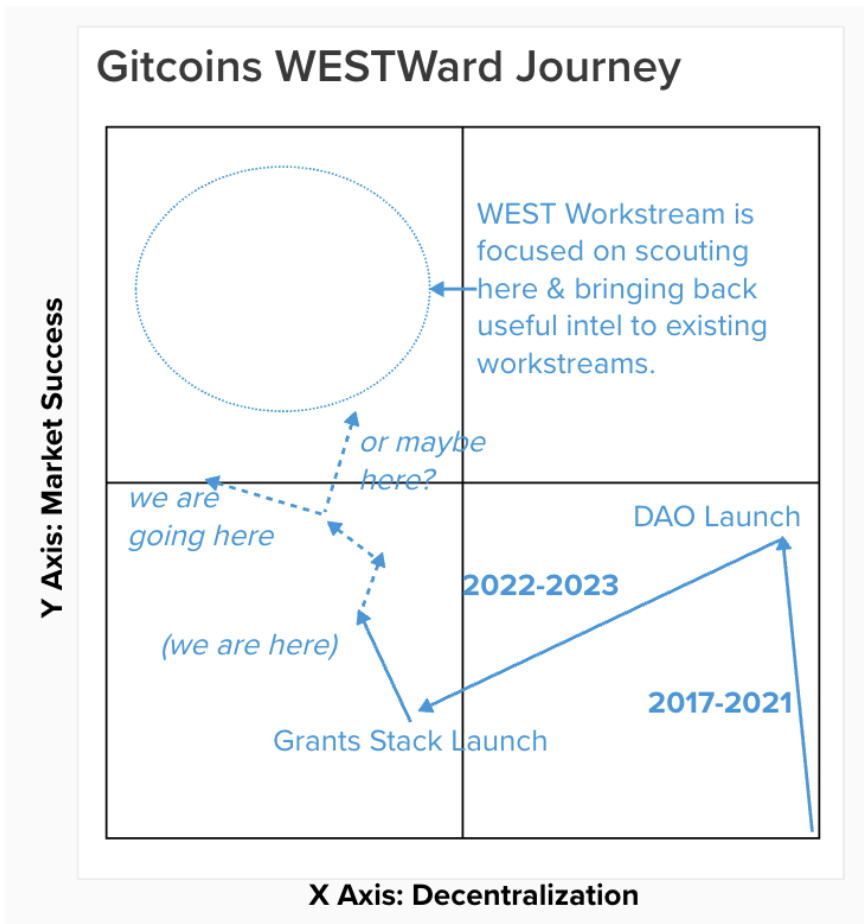

import { Callout } from "nextra/components";

<Callout type="warning">
  Warning: This resource describes planned functionality and processes that has
  not been implemented and is not part of any official roadmap. Be aware that parts may be inaccurate or out of
  date.  This document should not be relied on for financial, tax, business, or any other type of advice.
</Callout>

# We are here.

This document was written in August 2023.

# Goals 

The Goals for the endgame are to ensure Gitcoin is:

1. (mid-game, 18 months) as **successful** as possible in achieving it's mission.
2. (mid-game, 18 months) **thriving** financially & socially (not just *sustainable*).
3. (end-game, 4 years) **decentralized** at the layers of governance, product, tokenholder, and computation.
4. (end-game, 4 years) **reduce overhead** by cutting scope creep & relentlessly promoting focus.
5.  (evergreen) **force trade-offs** in timing, resourcing, and other pragmatic tradeoff spaces in order to chart a course to the above goals.

Other values to adhere to along the journey:
- Mission alignment
- Ethereum alignment
- Co-op values, mutualism, non plutocracy
- Simplicity at the center, Complexity to edges
- Outside Legitibility
- Incentive Alignment

# Tradeoff space

There are tradeoffs between these value & goals.  One of the primary ones is market successs vs decentralization.

