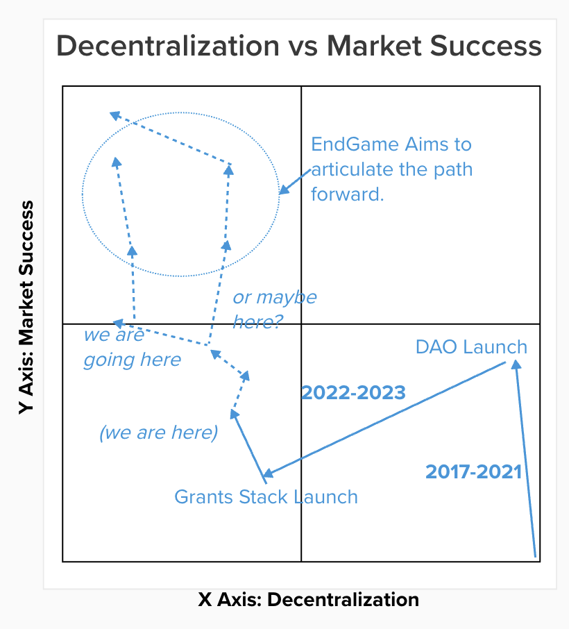

import { Callout } from "nextra/components";

<Callout type="warning">
  Warning: This resource describes planned functionality and processes that has
  not been implemented and is not part of any official roadmap. Be aware that parts may be inaccurate or out of
  date.  This document should not be relied on for financial, tax, business, or any other type of advice.
</Callout>

# We are here.

# Goals 

The Goals for the endgame are to ensure Gitcoin is:

1. (mid-game, 18 months) as **successful** as possible in achieving it's mission.
2. (mid-game, 18 months) **thriving** financially (not just *sustainable*).
3. (end-game, 4 years) **decentralized** at the layers of governance, product, tokenholder, and computation.
4. (end-game, 4 years) **reduce overhead** by cutting scope creep & relentlessly promoting focus.
5. (evergreen) **force trade-offs** in timing, resourcing, & other tradeoff spaces in order to chart a clear course to goals 1-5.

Other values to adhere to along the journey:
- Mission alignment
- Ethereum alignment
- Co-op values, mutualism, non plutocracy
- Simplicity at the center, Complexity to edges
- Outside Legitibility
- Incentive Alignment
- Momentum

# Tradeoff space

There are tradeoffs between these value & goals.  One of the primary ones is market successs vs decentralization.

# Core Elements

This Endgame Plan consists of the following main components, in sequence:
1. Product market fit.
2. Financial sustainability.
3. Ossify core 

## Specific plans

### 1. Create product market fit

TODO - write these
0. What has taken so long?
	1. Diagnosis of Gitcoins current malaise - despite high quality team members indinvidually, products are failing in market. market has passed it by. no sense of urgency, stuck in meta trap.. despite high sepnding, we missed ETHDenver 13-5-5 goals.
	2. We spent 24 months rewriting the entire stack - legal, governance, people, product, tech
1. How we win in market TODO i think this is on my main laptop?
	- losing in indnividudal categories
	- vertical integration
	- network effects
	- good brand
	- turn up the clock speed to explore the PMF design space faster
2. the path to PMF for:
	1. Passport
	2. Grants Stack
	3. Allo 
	4. PGN
	5. GTC
3. Compounding momentum
	1. Shout it from the rooftops: we are so back 
	2. Another airdrop
	3. add performance bonuses to comp structure endgame
	4. stop falling into https://gov.gitcoin.co/t/the-meta-trap/10666
	5. Network effects.

### 2. Financial sustainability.

TODO write about this
1. tokenomics
2. protocol governance
3. token utility

### 3. Ossify core & push complexity to other places.

2. push complexity to other places / Break into sub-daos.
3. Embrace network effects.
4. Ossify core into final form
5. going mainstream

